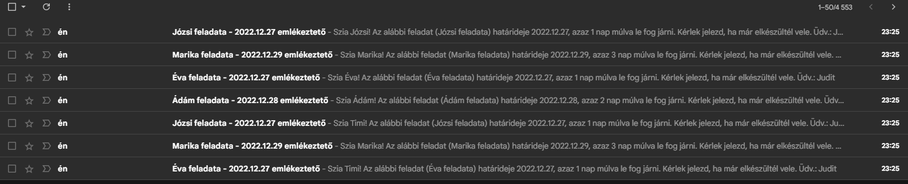

Deadline reminder mini projekt.

## Task:

My Wife, as office manager needs some automation in handling task and deadlines. She has 12 assigned colleague with several tasks.
The goal is to remind the colleagues of the deadlines.

## Solution:

The task are handled in a Google sheet which contains two sheets. In the first one are the tasks, deadlines and the assigned colleague stored, in the second one contains the list of all colleagues with their contats. The two sheets are connected:
- In first sheet the names can be chosen only from the sesond sheet via drop-down menu
- The contact adresses also are filled automatically with VLOOKUP from the second sheet.

### The flow:

## Result:

